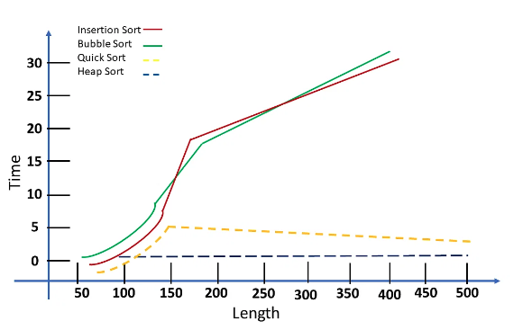

## Time complexity

Time complexity is defined in terms of `how many times it takes to run a given algorithm` based on the length of the input. Time complexity does not measure how long it takes to execute a particular algorithm.

 We define complexity as a numerical function *T(n)* - time versus the input size *n*. 

### Definition of Big-O

For any monotonic functions $f(n)$ and $g(n)$ from the positive integers to the positive integers, we say that $f(n) = O(g(n))$ when there exist constants $c > 0$ and $n_0 > 0$ such that
$$
f(n) \leq c * g(n)~for~all~n \geq n_0
$$

> The function f(n) **does not grow faster than g(n)**, or that function g(n) is an **upper bound** for f(n) for all sufficiently large $n→\infty$.

Here is a graphic representation of $f(n) = O(g(n))$ relation:

Examples: 

- $1 = O(n)$
- $n = O(n^2)$
- $log(n) = O(n)$
- $2 n + 1 = O(n)$
- $3n^3 + 5n^2 + 1,000,000 = O(n^3)$

#### Constant Time: $O(1)$

An algorithm is said to run in constant time if it requires `the same amount of time regardless of the input size`. 

- array: accessing any element
- Fixed-size stack: push and pop methods
- Fixed-size queue: enqueue and dequeue methods

#### Linear Time: $O(n)$

An algorithm is said to run in linear time if its time execution is `directly proportional to the input size`, i.e., time grows linearly as the input size increases. Examples:

- Array: linear search, traversing, finding the minimum
- ArrayList: contains method
- queue: contains method

#### Logarithmic Time: $O(log n)$

An algorithm is said to run in logarithmic time if its time execution is proportional to `the logarithm of the input size`. Example:

- binary search

#### Quadratic Time: $O(n^2)$

An algorithm is said to run in logarithmic time if its time execution is proportional to `the square of the input size`. Examples:

- Bubble sort, selection sort, insertion sort

### Significant in Terms of Time Complexity

The input size has a strong relationship with time complexity. As the size of the input increases, so does the runtime, or the amount of time it takes the algorithm to run. 

Assume you have a set of numbers S= (10, 50, 20, 15, 30). There are `numerous algorithms` for sorting the given numbers. However, not all of them are effective. You must perform computational analysis on each algorithm to determine the most effective one.

The results were as follows: "[Heap Sort algorithms](https://www.simplilearn.com/tutorials/c-tutorial/heap-sort-in-c-program) performed well despite the length of the lists; on the other hand, you discovered that Insertion sort and Bubble sort algorithms performed far worse, significantly increasing computing time."

## Space complexity

Space complexity refers to **the total amount of memory space an algorithm/program uses, including the space of input values for execution**.

However, people frequently confuse Space-complexity with auxiliary space. Auxiliary space is simply extra or temporary space, and it is not the same as space complexity. To put it another way, ` Auxiliary space + space used by input values = Space Complexity`. 

>  The best algorithm/program should have a low level of space complexity. The less space required, the faster it executes.

## Methods for Calculating Time Complexity

We calculate the `time complexity` of the multiply function:

Let T(n) be a function of the algorithm's time complexity. 

- Lines 1 and 2 have a time complexity of O(1).

- Line 3 represents a loop. As a result, you must repeat lines 4 and 5 (n -1) times. 

- The time complexity of lines 4 and 5 is O(n).

- Finally, adding the time complexity of all the lines yields the overall time complexity of the multiple functions $T(n) = O(n)$.

Time limitation of Coding test

- If $N > 500$, the time complexity should be $O(N^3)$ on an algorithm.
- If $N > 2,000$, the time complexity should be $O(N^2)$ on an algorithm.
- If $N > 100,000$, the time complexity should be $O(NlogN)$ on an algorithm.
- If $N > 10,000,000$, the time complexity should be $O(N)$ on an algorithm.

We calculate the `space complexity` of the multiply function:

Let S(n) denote the algorithm's space complexity. 

In most systems, an integer occupies `4 bytes of memory`. As a result, the number of allocated bytes would be the space complexity.

- Line 1 allocates memory space for `two integers`, resulting in S(n) = 4 bytes$\cdot 2$ = 8 bytes.
- Line 2 represents a loop. Lines 3 and 4 assign a value to an already existing variable. As a result, there is no need to set aside any space. The `return` statement in line 6 will allocate one more memory case. 
- As a result, $S(n)= 4 \cdot 2 + 4 = 12$ bytes.
- Because the array is used in the algorithm to allocate n cases of integers, the final space complexity will be $S(n) = n + 12 = O (n)$.

| Time Complexity                                        | Space Complexity                                             |
| ------------------------------------------------------ | ------------------------------------------------------------ |
| Calculates the time required                           | Estimates the space memory required                          |
| Time is counted for all statements                     | Memory space is counted for all variables, inputs, and outputs. |
| The size of the input data is the primary determinant. | Primarily determined by the auxiliary variable size          |
| More crucial in terms of solution optimization         | More essential in terms of solution optimization             |
